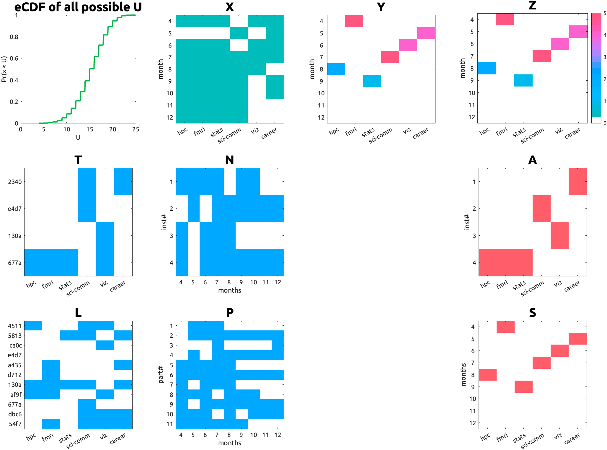

In the spirit of [over-engineering](https://en.wikipedia.org/wiki/Over-engineering), I have developed a Grossly Over-Optimising[^1] (GOO) algorithm to organise a series of workshops. The algorithm is designed to maximise the utilitarian utility of a community (i.e., the sum of the utilities of all individuals).


## 0. Definition

Session: one-hour teaching session on every first Thursday, 10 am, either in the 2nd floor or the 1st floor meeting room.

_Topic_: a subject for the session.

_Instructor_: a person who teaches a topic with ≤10 slides.

_Participant_: a person who learns a topic.

Let's say we have multiple rectangular binary matrices that code:

- which instructor wants to teach which topic:  
$\mathbf{T}$ <\#Instructors x \#Topics>

- which instructor can come in which month: $\mathbf{N}$ <#Instructors x #Topics>

- which participant wants to learn which topic: $\mathbf{L}$ <#Participants x #Topics>

- which participant can come in which month: $\mathbf{P}$ <#Participants x #Topics>

For simplicity, we discarded topics without any instructors.

### 0.1. Utility function

The aggregated utility of all participants is defined as the sum of the number of participants over all months.

Say we have a rectangular matrix: $\mathbf{Z}$ <#Months x #Topics> with the number of interested participants who are able to come as its elements. Then the utility is defined as:

$$
U = ζ(\mathbf{Z}) =  Σ_{i,j} z(i,j)
$$

in a unit of _"a person's happiness"_. Based on the utilitarian view, every individual has an equal contribution to the community-level utility.

### 0.2. Future discount

Classically, (British) economists have argued that it is not a sin for banks to take interest (for loans that funded piracy/colonial business) by theorising "future discount".💰 While its historical application is morally ambiguous, the notion that "future uncertainty should be addressed"💸 may still be valid even for our cause, simply because we have less information about events in the distant future. 🔮 (That is, it may be reasonable to think that a marshmallow promised in 15 minutes is not really 1 marshmallow but 0.9 marshmallows, because that mean psychologist might eat up everything in the meantime!; See: <https://en.wikipedia.org/wiki/Stanford_marshmallow_experiment>)

The discount rate is based on the Bundesbank basic rate of interest as of 2026-01-01 ([LINK](https://www.bundesbank.de/en/bundesbank/organisation/gtc-and-legal-basis/basic-rate-of-interest-616708)): 1.27% per annum, which is 0.1058% per mensem.

The weight for the m-th month is $w(m) = (1 - \lambda)^{m-1}$ where $\lambda$ is the discount per mensem (here, $\lambda=0.1058/100$). Then the discounted utility is defined as:

$$
U = ζ(\mathbf{Z}, \mathbf{w}) =  Σ_{i,j} z(i,j).w(i)
$$

### 0.3. Solution

Now we need to figure out who will teach what when, while maximising the sum of happiness of individual members (very utilitarian).

Our decisions on `<when>` `<who>` `<what>` can be coded in two rectangular binary matrices as:

- which month will host which topic:  $\mathbf{S}$ <#Months x #Topics>

- which instructor will teach which topic: $\mathbf{A}$ <#Instructors x #Topics> 

The Session matrix S has a policy-wise constraint:

- The sum of each column ≤ 1 (one month can host only one topic).

The Assignment matrix A has the following constraints:

- The sum of each column ≤ 1 (one topic is taught by only one instructor).

- $a(i,j) ≤ t(i,j)$ (an instructor can only teach a topic if they want to teach it).

These rules were enforced when generating random solutions, so the optimiser only needs to evaluate the utility of legal solutions.

## 1. Evaluation

With the given S and A, we can compute Z as:

$$
\mathbf{Z} = \mathbf{X} ⊙ \mathbf{Y}
$$

where $\mathbf{X}$ <#Months x #Topics> is the possible teaching matrix (combining interest, availability, and assignment):

$$
\mathbf{X} = \mathbf{N}'(\mathbf{T} ⊙ \mathbf{A})  
$$
 
and $\mathbf{Y}$ <#Months x #Topics> is the possible participation matrix (combining interest, availability, and assignment):

$$
\mathbf{Y} = (\mathbf{P}'\mathbf{L}) ⊙ \mathbf{S} 
$$

Here, $⊙$ denotes the element-wise (Hadamard) product, and the prime ($'$) denotes matrix transposition.


That is, the utility can be expanded as:

$$
U = ζ[ {N'(T ⊙ A)} ⊙ {(P'L) ⊙ S}, w ]
$$

## 2. Optimisation

The universal optimiser (i.e., "try-many-random-legal-solutions-and-find-the-best-one") is used. To ensure reproducibility and avoid storing the entire matrices, a sequence of natural numbers was used as seed values. A reasonable search could have stopped at around 100,000 iterations (3.332 seconds). But GOO is committed to the over-optimisation and was willing to sample more than the total number of possible combinations. So, the search was extended to 10,000,000 iterations (333.550 seconds). "The solution was identical to that with 100,000 iterations and a complete waste of time (nice!)." could have been hilarious, but it turns out that we need this many iterations for this brute-force approach. 🤷

## 3. Implementation
I'm old school, so I implemented the GOO algorithm in MATLAB:
```{MATLAB}
function [X, Y, S, A, u] = createrandsolution(seed, nMonths, nTopics, nInst, N, T, P, L, w)
rng(seed)
% create only LEGAL S:
S = false(nMonths, nTopics);
assert(nMonths > nTopics)
idx = randperm(nMonths, nTopics);
for j = 1:numel(idx)
  S(idx(j),j) = true;
end

% create only LEGAL A:
A = false(nInst, nTopics);
for jTopic = 1:nTopics
  idx = find(T(:,jTopic));
  idx = idx(randperm(numel(idx)));
  A(idx(1), jTopic) = true;
end

X = N' * (T.*A);   % months x topics
Y = (P'*L) .* S;   % months x topics
Z = X .* Y;

Z = Z .* w'; % apply discount
u = sum(Z(:));

u = u + sum(any(A,2)); % instructors have a step utility function.
end
```
Then you just call the function with different seed values and keep the best solution:
```{MATLAB}
best_u = -Inf;
for seed = 1:1e7
  [~,~,~,~, u] = createrandsolution(seed, nMonths, nTopics, nInst, N, T, P, L, w);
  if u > best_u
    seed_star = seed;
    u_star = u;
  end
end

[X_star, Y_star, S_star, A_star] = createrandsolution(seed_star, nMonths, nTopics, nInst, N, T, P, L, w);
```

## 4. Results
The random search with 1e7 (ten million) iterations took 358.2 seconds and found a solution with a utility of 24.96 happiness.

<!--  -->
|  |
| _Fig 1. An example solution. Names are hashed. Topic names are abbreviated._ |

---
[^1]: Since the second Trump administraion ("Fool me twice, ..."), I decided to use British spelling instead, because now it feels somehow very awkward.

